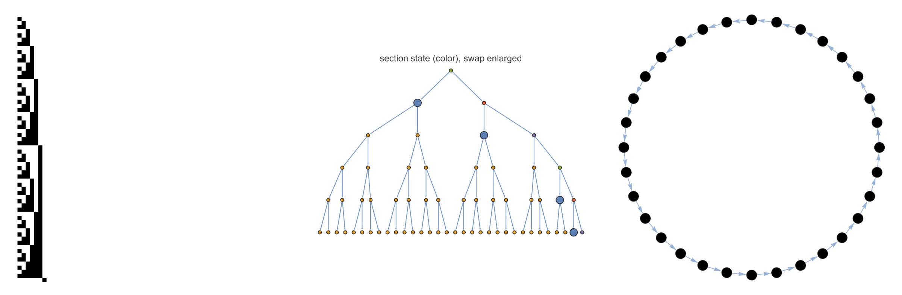

> ⚠️ **Actively developed, experimental research code.** It undergoes frequent cleanings and refactors, and the API may change without notice.

# IteratedFiniteAutomaton

An iterated finite automaton can be assigned a group.
Such groups were used in the past to construct counterexamples in group theory, as described in Andrzej Żuk's essay **[Iterated finite automata](https://community.wolfram.com/groups/-/m/t/3761828)**.
This repository collects the tools and the open problems, so that researchers can attack them systematically — and by systematic exploration of the landscape of small automata.



*Left:* the adding machine iterated on a zero tape — the binary counter.
*Middle:* a tree portrait of the Grigorchuk generator $b$ down to depth 5, each vertex coloured by the section there and enlarged where that section permutes its colours.
*Right:* the adding machine's action on level 5, a single 32-cycle, which is why its period is $2^L$ from every tape.

## 🎯 Goals

- Collect tools for the ruliology of iterated finite automata
- Bridge automata and group theory — translate automaton behavior into group properties, and back
- Find automata whose groups serve as examples, or counterexamples, to statements in group theory
- Collect the open problems on both sides that the bridge could reach
- Target them, by exhaustive search over the small automata
- Formalize the definitions and results in Lean

## ✨ Usage

Install the paclet:

```wolfram
PacletInstall["https://www.wolframcloud.com/obj/hajek_pavel/IteratedFiniteAutomaton.paclet"]
Needs["WolframInstitute`IteratedFiniteAutomaton`"]
```

The paclet is not in the Wolfram Paclet Repository, so it installs from a public cloud object.
The URL is stable across releases — each one overwrites it — so check `PacletObject["WolframInstitute/IteratedFiniteAutomaton"]["Version"]` to see what you got.
**That object currently serves 0.3.0, one release behind this repository.**
`main` is **0.4.0**, which adds the constructive families of many-state automata and the exercised state subgraph; until the object is refreshed, those five exports are reachable only by building from this checkout — see [`REPRODUCING.md`](REPRODUCING.md).

## 📓 Research Notebooks

| Notebook | Description | Link |
|---|---|---|
| Wolfram and wreath recursion | Converting between the automaton formalisms | [Wolfram Cloud](https://www.wolframcloud.com/obj/hajek_pavel/IteratedFiniteAutomaton/Research/Formalisms.nb) |
| Periodicity of the iteration | Periods of the evolution and orders of group elements | [Wolfram Cloud](https://www.wolframcloud.com/obj/hajek_pavel/IteratedFiniteAutomaton/Research/Periodicity.nb) |
| Automata on the rooted tree | Space-time diagrams and tree portraits | [Wolfram Cloud](https://www.wolframcloud.com/obj/hajek_pavel/IteratedFiniteAutomaton/Research/Visualization.nb) |
| Burnside problem | An infinite torsion group from a 5-state automaton | [Wolfram Cloud](https://www.wolframcloud.com/obj/hajek_pavel/IteratedFiniteAutomaton/Research/Burnside.nb) |
| Kaplansky zero-divisor conjecture | Zero divisors in the group ring | [Wolfram Cloud](https://www.wolframcloud.com/obj/hajek_pavel/IteratedFiniteAutomaton/Research/Kaplansky.nb) |
| Sweep of the 3-state binary automata | Which groups survive the zero-divisor test | [Wolfram Cloud](https://www.wolframcloud.com/obj/hajek_pavel/IteratedFiniteAutomaton/Research/KaplanskySweep.nb) |
| Open problems, as automaton statements | One runnable test per problem in [`OpenProblems.md`](OpenProblems.md) | [Wolfram Cloud](https://www.wolframcloud.com/obj/hajek_pavel/IteratedFiniteAutomaton/Research/OpenProblems.nb) |
| Constructive families of many-state automata | Building automata where the space is too large to enumerate, and what many states buy | [Wolfram Cloud](https://www.wolframcloud.com/obj/hajek_pavel/IteratedFiniteAutomaton/Research/ManyStateAutomata.nb) |

## 🧩 Open Problems

Statements in group theory that one group can settle, so that one automaton can.
Some already fell to an automaton group; others fell to a hand-built group, and an automaton realization would be a simpler counterexample; the rest are open.
Throughout $G$ is finitely generated and $K$ is a field.

The problem name links to a statement of it; the date links to its primary reference in [`References.md`](References.md).
This table is the short version.
The long one is **[`OpenProblems.md`](OpenProblems.md)** — 19 problems, each with the automaton statement that would settle it, how faithful that translation is, what a witness would look like, the paclet call that searches for one, and how far this repository has already searched.

| Problem | Formulation | Answer | Relation to automata |
|---|---|:-:|---|
| [Burnside](https://en.wikipedia.org/wiki/Burnside_problem) ([1902](References.md#Burnside1902)) | every $g \in G$ of finite order $\Rightarrow G$ finite? | ✅ No | [Grigorchuk](References.md#Grigorchuk1980) counterexample with 5 states and 2 colors, infinite with every element of order a power of $2$; [Gupta–Sidki](References.md#GuptaSidki1983) with 3 colors. Both far simpler than the first counterexample, of [Golod–Shafarevich](References.md#Golod1964) |
| [Milnor](https://en.wikipedia.org/wiki/Growth_rate_%28group_theory%29) ([1968](References.md#Milnor1968)) | is $\gamma_G(n) = \lvert B_n \rvert$ polynomial or exponential? | ✅ No | [Grigorchuk](References.md#Grigorchuk1985) counterexample with 5 states and 2 colors, growing like $e^{n^\alpha}$ for some $0 < \alpha < 1$ |
| [Day](https://en.wikipedia.org/wiki/Elementary_amenable_group) ([1957](References.md#Day1957)) | is every amenable group elementarily amenable? | ✅ No | [Grigorchuk](References.md#Grigorchuk1985) counterexample with 5 states and 2 colors. The [Basilica](References.md#GrigorchukZuk2002) counterexample, 3 states and 2 colors, is [amenable](References.md#BartholdiVirag2005) but not even subexponentially amenable |
| [Atiyah](https://en.wikipedia.org/wiki/Atiyah_conjecture) ([1976](References.md#Atiyah1976)) | $M$ closed with $\pi_1(M) = G \Rightarrow b_i^{(2)}(M) \in \mathbb{Z}$? | ✅ No | [Lamplighter](References.md#GrigorchukZuk2001) counterexample with 2 states and 2 colors, by [Grigorchuk–Linnell–Schick–Żuk](References.md#GLSZ2000) |
| [von Neumann](https://en.wikipedia.org/wiki/Von_Neumann_conjecture) ([1950s](References.md#Neumann1929)) | $G$ non-amenable $\Rightarrow G$ contains a free subgroup of rank $2$? | ✅ No | ❓ On the group side, [Ol'shanskii](References.md#Olshanskii1980)'s Tarski monsters and [Adyan](References.md#Adyan1983)'s free Burnside groups. Neither can be an automaton group: both have finite exponent, and a finitely generated residually finite group of finite exponent is finite ([Zel'manov](References.md#Zelmanov1991)). The torsion-free counterexamples of [Monod](References.md#Monod2013) and [Lodha–Moore](References.md#LodhaMoore2013) escape that argument |
| [Kaplansky units](https://en.wikipedia.org/wiki/Kaplansky%27s_conjectures) ([1950s](References.md#Kaplansky1970)) | $G$ torsion-free $\Rightarrow$ every $u \in K[G]^\times$ is $\lambda g$? | ✅ No | ❓ On the group side, [Gardam](References.md#Gardam2021)'s unit in $\mathbb{F}_2[P]$, $P$ the [Promislow](References.md#Promislow1988) group, found by SAT search. Whether $P$ is an automaton group is open |
| [Zassenhaus](https://arxiv.org/abs/1710.08780) ([1974](References.md#Zassenhaus1974)) | $G$ finite, $u \in \mathbb{Z}[G]^\times$ of finite order $\Rightarrow u$ rationally conjugate to some $\pm g$? | ✅ No | ❓ On the group side, [Eisele–Margolis](References.md#EiseleMargolis2018)'s metabelian group of order $2^7 3^2 5 \cdot 7^2 19^2$. No automaton counterexample known |
| [Kaplansky zero divisors](https://en.wikipedia.org/wiki/Kaplansky%27s_conjectures) ([1950s](References.md#Kaplansky1970)) | $G$ torsion-free, $a, b \in K[G] \setminus \{0\} \Rightarrow ab \neq 0$? | ❓ | ❓ Sweeping the automata whose groups are torsion-free — [bounded and contracting](References.md#Nekrashevych2005) ones are — for a vanishing product. Done here for 3 states and 2 colors |
| [Gap](https://en.wikipedia.org/wiki/Growth_rate_%28group_theory%29) ([Grigorchuk](References.md#Grigorchuk2014b)) | is $\gamma_G(n)$ polynomial or at least $e^{\sqrt n}$? | ❓ | ❓ Sweeping automata for a group growing below $e^{\sqrt n}$; the branch and automaton groups are the test class |

Cases decided by a theorem rather than a search are cited where they are used: left-orderability gives a domain ([Higman](References.md#Higman1940)) via local indicability ([Burns–Hale](References.md#BurnsHale1972)), and torsion-free elementary amenable groups satisfy Kaplansky ([Kropholler–Linnell–Moody](References.md#KLM1988)).
Finiteness of an automaton group is undecidable in the semigroup setting ([Gillibert](References.md#Gillibert2014)), so every test here is a bounded search.
The order problem is undecidable outright ([Gillibert](References.md#Gillibert2018), [Bartholdi–Mitrofanov](References.md#BartholdiMitrofanov2020)), which is why the torsion filter every sweep rests on is a filter and not a test — [`OpenProblems.md`](OpenProblems.md) says so entry by entry.

## 🌳 References

The annotated bibliography is **[`References.md`](References.md)** — 89 entries, grouped by the role each plays here, each annotated with why it matters to this repository and linked by DOI or arXiv ID wherever one exists.
Its biblatex form is [`references.bib`](references.bib).

The source of the project: Andrzej Żuk, *Iterated finite automata*, WSRI 2026 — <https://community.wolfram.com/groups/-/m/t/3761828>

No Wolfram Language functionality for automata groups exists — `transducer` and `Mealy` match no documented symbol, and neither the Function Repository nor the Paclet Repository has anything on self-similar or branch groups.
The prior art is GAP's [`AutomGrp`](References.md#AutomGrp) and [`FR`](References.md#FR).

## 🔬 Reproducing

[`REPRODUCING.md`](REPRODUCING.md) records the Wolfram version, how to load the paclet from source, how to run the test suite (**123 tests, ~10 s**), and how to reproduce the catalog's test recipes — every instruction executed from a clean checkout before being written down.
It also says plainly what this repository does *not* let you re-run: the four exhaustive sweeps and the notebook builds live in a separate private development repository, so their parameters are documented here but their drivers are not.

## 📐 What is proven, computed, and conjectured

Three different kinds of claim, kept apart on purpose.

- **Proven** — nothing new. Every theorem cited is someone else's, and [`References.md`](References.md) says whose.
- **Computed** — the contents of every `Searched here` field in [`OpenProblems.md`](OpenProblems.md), each stated with the bound that makes it falsifiable: a space, a radius, a field, a weight bound, and the level at which the refutation happened. An empty search is recorded as an empty search, never as evidence.
- **Conjectured** — the `Conjecture` and `Question` environments in the research notebooks, each with the range over which it was verified and no claim beyond it.

The `Faithfulness` field grades every translation as `Equivalent`, `Sufficient`, `Necessary`, `Heuristic` or `None`, from a closed list, so a translation that is only an analogy has to say so in a field instead of hedging in prose.

## 📄 License and citation

MIT — see [`LICENSE`](LICENSE). To cite the software, see [`CITATION.cff`](CITATION.cff); to cite the mathematics, cite the works in [`References.md`](References.md) directly.

Contributions: [`CONTRIBUTING.md`](CONTRIBUTING.md).
